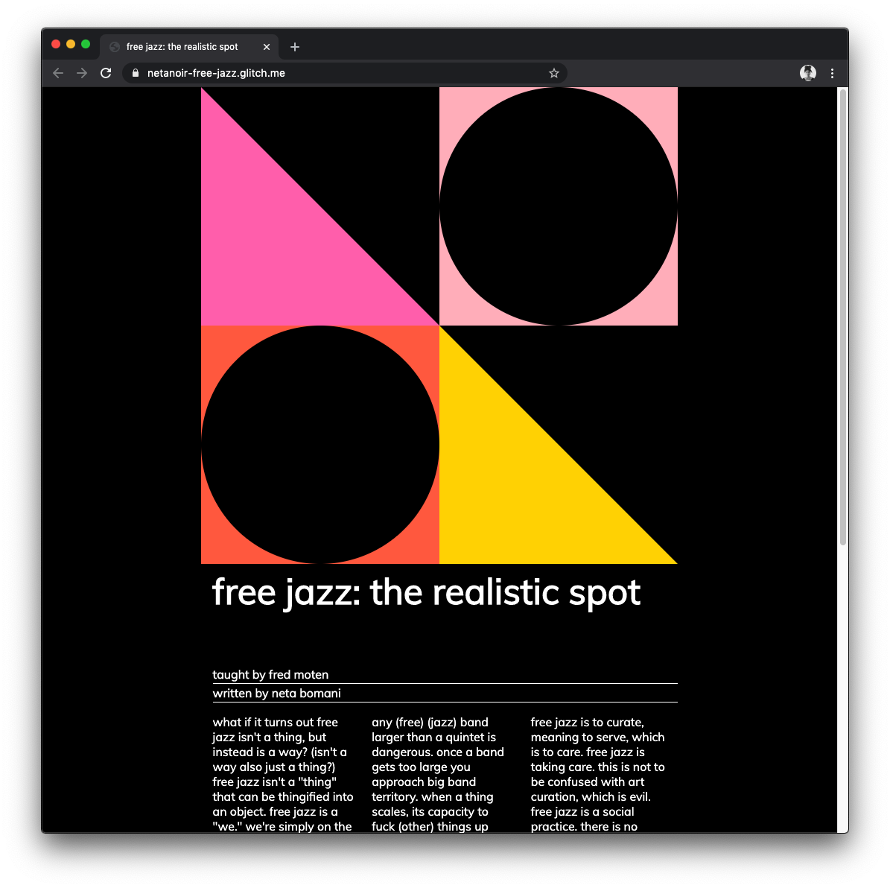

<!-- Every README should start with an H1 -->
# free jazz: the realistic spot
taught by [fred moten](https://tisch.nyu.edu/about/directory/performance-studies/fred-moten)
written by [neta bomani](https://netabomani.com)

<!-- A one sentence description of the project or assignment -->
this web zine is a synthesis of notes from fred moten's free jazz class a new york university. 
view online [here](https://netanoir-free-jazz.glitch.me/).

<!-- It is essential to describe how to set up your project -->
## setup

<!-- Any knowledge or tools you will need before hand -->
### prerequisites and installation

1. terminal
2. [git](https://git-scm.com/downloads) and [github desktop app](https://desktop.github.com/)
3. local server ([python simple server](https://docs.python.org/2/library/simplehttpserver.html))
3. text editor ([vs code](https://code.visualstudio.com/))
4. deployment tool ([glitch](https://glitch.me))

<!-- Write instructions on how to start working on your project -->
### develop

To add to this zine, you can follow the steps provided below:
1. create a fork of this project on Github
2. ping the author of this repo via Github Issues to see if they are looking for contributions on the specific feature you're looking to add
3. open the file in vs Code and make updates 
4. add and commit those changes in your forked github repo
5. make a pull request specifying what additions and changes were made
6. have a nice chat and communication with me about those changes. 
7. celebrate the contribution! 

### (develop) from scratch
after installing the prerequisites, follow the following steps:
1. open terminal
2. create free-jazz directory `mkdir free-jazz`
3. track changes `git init `
4. open project directory in text editor (if using VS code, create and us terminal shell command `code .`)
5. add/edit your code
6. open new terminal tab
7. start local server `python -m SimpleHTTPServer 8000`
8. open browser and navigate to `localhost:8000` to view your code additions/edits
8. when ready to publish repository, open github desktop app > add existing repository > navigate to free-jazz directory in finder
9. add new files `git add .`, commit changes `git commit -m "my changes"`, and add to repository `git push`

<!-- Notes about the deployment -->
### deployment

## built with

* terminal
* [vs Code](https://code.visualstudio.com/)
* [github](https://github.com) 
* [glitch](https://glitch.me)

## authors

[neta bomani](https://netabomani.com)

## code of conduct

please read the [code of conduct](https://www.mozilla.org/en-US/about/governance/policies/participation/) 

## License

this readme template is licensed according to [Attribution 4.0 International (CC BY 4.0) ](https://creativecommons.org/licenses/by/4.0/)

<!-- thank and reference all the things that made your project happen -->
## acknowledgements

* [Joey Lee](https://jk-lee.com/), who this was made under the instruction of 
* [Bomani McClendon](https://bomani.xyz), who helped me troubleshoot
* [the replacements](https://www.swissted.com/products/the-replacements-at-cabaret-metro-1985), visual poster reference for design
* [flexible squares](https://codepen.io/stevemckinney/pen/dGzXwO), help with flexible css squares
* [css tricks](https://css-tricks.com/the-shapes-of-css/), help with drawing shapes in css
* [creative Commons](https://creativecommons.org/licenses/by/4.0/) for their licensing documentation
